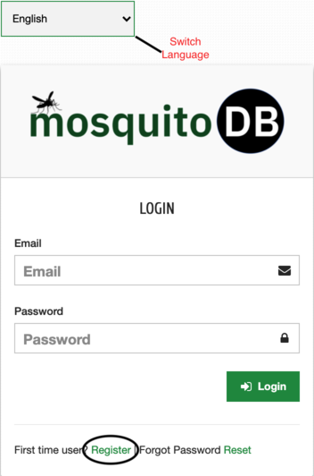
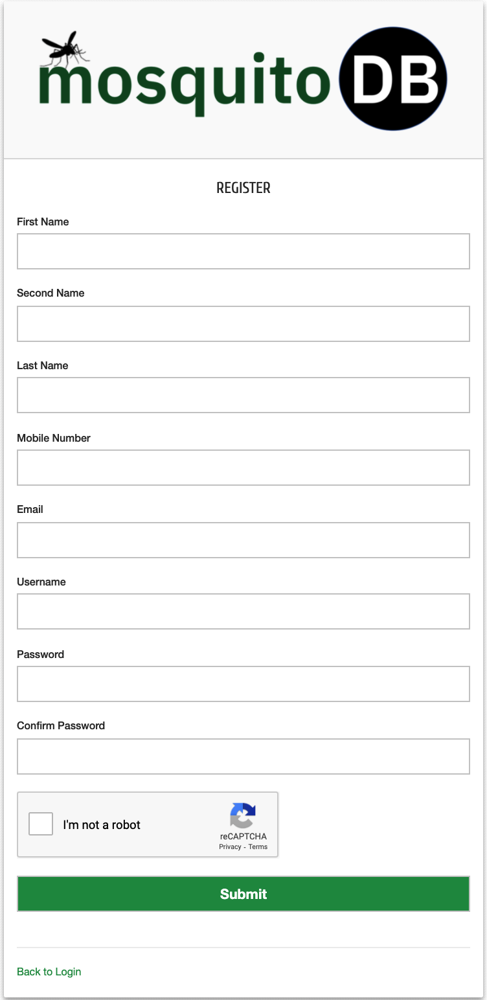

Enregistrer votre compte
=========================

Cliquez sur le bouton « S'inscrire », situé sur la page de connexion selon l'image ci-dessous. Cela vous amènera à la page d'inscription où vous pourrez entrer vos coordonnées.

Lors de la soumission, le système enverra un "e-mail d'activation" à votre e-mail enregistré à des fins de sécurité. Si vous ne le trouvez pas dans votre boîte de réception, veuillez vérifier votre dossier de courrier indésirable. Cliquez sur le bouton Activer le compte sur le courrier reçu et votre compte sera activé.

Si vous êtes un utilisateur francophone, cliquez sur le bouton de langue pour passer à votre langue préférée.

