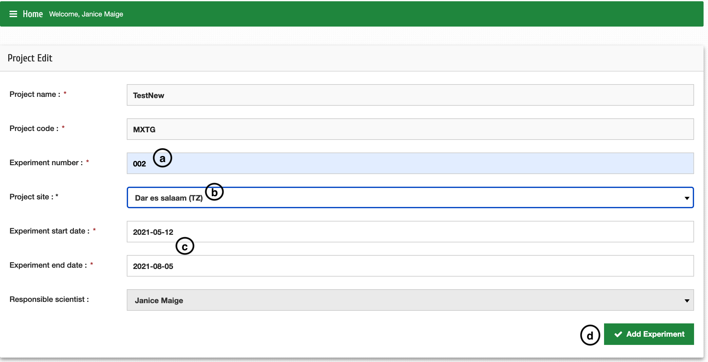

Ajouter une expérience à un projet
====================================

| **Étape 1**: Cliquez sur Projets puis sur Gérer le projet
| **Étape 2**: Recherchez votre projet en fonction du code du projet (par exemple, MXTG) 
| **Étape 3**: Cliquez sur le bouton **+Exp**

| **Étape 4**: Saisissez les nouveaux détails de l'expérience ; 
|            **a**: Numéro d'expérience (par exemple, 002)
|            **b**: Sélectionnez le nom du site dans un menu déroulant (si non disponible – Ajouter un site ?)
|            **c**: Sélectionnez la date appropriée - même pour la date de fin prévue 

| **NB**: Les autres champs sont remplis par défaut

| **d**: Cliquez sur "Ajouter une expérience"

