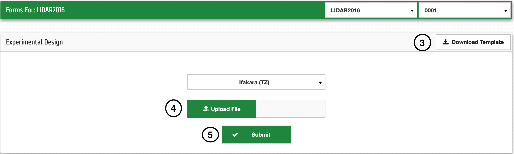

La saisie des données
======================

À la fin de votre expérience, vous pouvez télécharger des données sur le système via l'application Web ou l'application Android. 

**NB:** Cela peut être fait après avoir personnalisé le formulaire en suivant les étapes de 4.2.1

Sélection du formulaire de saisie
----------------------------------

| **Étape 1**: Cliquez sur Formulaires dans le menu
| **Étape 2**: Guidez le curseur vers le haut du type de formulaire que vous souhaitez sélectionner le formulaire spécifique dans la liste déroulante

.. image:: ../_images/mainmenu.png

| **Étape 3**: Cliquez sur Télécharger le modèle, puis saisissez les données dans la feuille Excel téléchargée

| **Étape 4**: Cliquez sur Télécharger le fichier et sélectionnez le fichier Excel rempli
| **Étape 5**: Cliquez sur Soumettre

.. Importation de données au format CSV
.. -------------------------------------

.. .. image:: ../_images/forms.png
