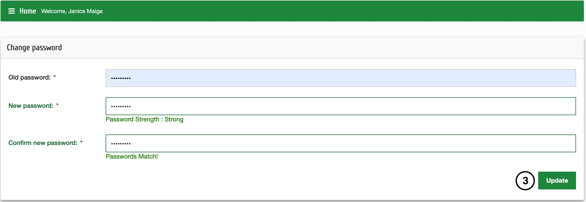

Editer le profil
=================

Une fois enregistré dans Mosquito DB, vous pouvez modifier vos informations d'utilisateur en suivant les étapes ci-dessous ;

| **Étape 1**: Cliquez sur votre nom en haut à gauche de la page, puis sélectionnez Profil dans la liste déroulante
| **Étape 2**: Cliquez sur Modifier le profil pour modifier vos informations ou Modifier le mot de passe pour modifier votre mot de passe
| **Étape 3**: Après l'édition, cliquez sur Mettre à jour pour enregistrer vos modifications

