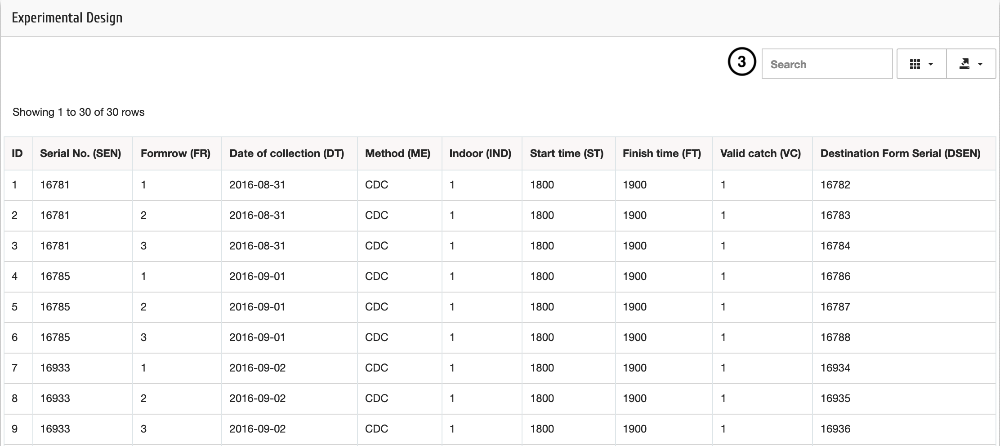

Ensembles de données
=====================

Pour afficher les ensembles de données d'un projet spécifique, sélectionnez ensuite le numéro du projet et de l'expérience ; 

| **Étape 1**: Cliquez sur Tableaux dans le menu
| **Étape 2**: Sélectionnez le formulaire à partir duquel vous souhaitez afficher les données, par exemple Experimental Design 1 pour afficher les données collectées à l'aide de ED1
| **Étape 3**: Vous pouvez maintenant afficher les données et rechercher une donnée spécifique que vous souhaitez.

.. image:: ../_images/dataset.png 
   

