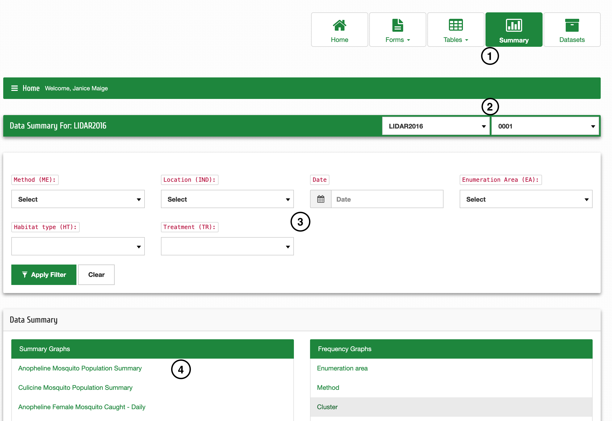

Résumé des données
===================

| **Étape 1**: Cliquez sur Résumé
| **Étape 2**: Sélectionnez le code du projet et le numéro de l'expérience dont vous souhaitez afficher les données
| **Étape 3**: Filtrez les données des onglets, c'est-à-dire Méthode, Emplacement, Date, etc. Cliquez sur "Effacer" pour effacer les sélections pour la ré-entrée. (Étape facultative)
| **Étape 4**: Cliquez sur le résumé que vous souhaitez afficher dans le tableau récapitulatif des données ou les graphiques de fréquence en fonction des données disponibles et/ou filtrées.

