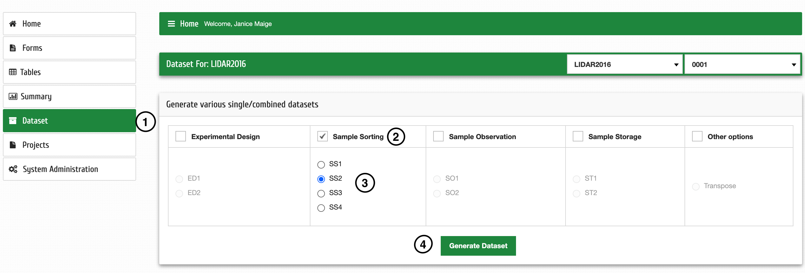
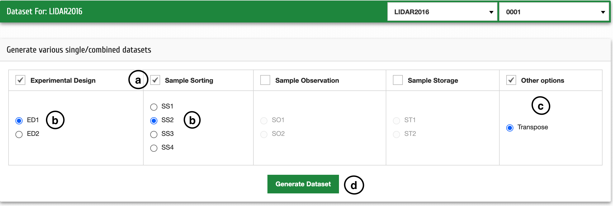

Téléchargement de données
===========================

| **Étape 1**: Sélectionnez le projet et l'expérimentation, puis cliquez sur Dataset
| **Étape 2**: Sélectionnez le formulaire à partir duquel vous voulez des données, par exemple des données de tri d'échantillons
| **Étape 3**: Sélectionnez ensuite les données de tri d'échantillons spécifiques, par exemple SS2
| **Étape 4**: Cliquez sur Générer un jeu de données

Si vous souhaitez sélectionner des données à partir de différents formulaires, alors ;

| **a**: Sélectionnez les formulaires que vous souhaitez, par exemple la conception expérimentale et le tri des échantillons
| **b**: Sélectionnez les formulaires spécifiques, par exemple ED1 et SS2
| **c**: Sélectionnez Autres options, puis cliquez sur Transposer
| **d**: Cliquez sur Générer un jeu de données

