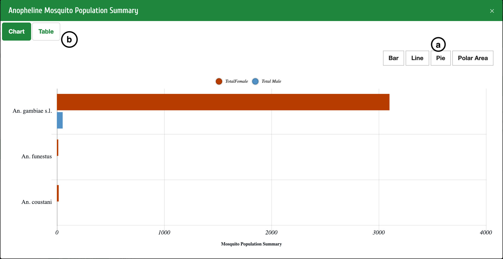
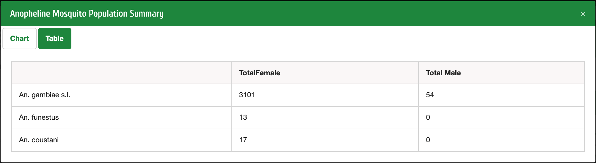

Travailler avec des graphiques
===============================

| **a**: Vous pouvez afficher différents graphiques en sélectionnant Bar, Line , Pie ou Polar Area
| **b**: Vous pouvez sélectionner Tableau pour afficher les données sous forme de tableau

   

   

