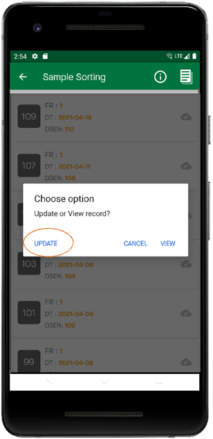

Modifier les données
=====================

| **Étape 1:** Sur la page d'accueil, sélectionnez **Modifier les données**
| **Étape 2:** Sélectionnez le formulaire dont vous souhaitez modifier les données, par exemple le tri des échantillons
| **Étape 3:** Sélectionnez si vous souhaitez afficher ou mettre à jour les données. En cliquant sur Mettre à jour, vous pourrez modifier les données. 
| **Étape 4:** Cliquez sur Enregistrer pour conserver vos modifications mises à jour. 

.. image:: ../../_images/editdata.png
   :width: 77%

   :width: 22%

