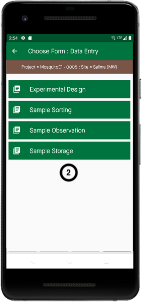
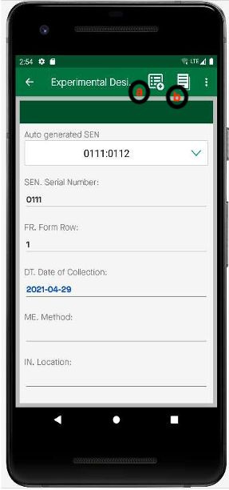

Conception expérimentale
=========================

| **Étape 1:** Sur la page d'accueil, sélectionnez **Entrer des données**
| **Étape 2:** Sélectionnez le formulaire pour lequel vous souhaitez saisir des données, par exemple un formulaire de conception expérimentale (Revoyez le chapitre 4.2, pour l'utilisation des formulaires). Choisissez ensuite le numéro du formulaire en fonction de votre expérience par exemple si vous travaillez sur le terrain, utilisez alors ED1

**NB:** Vous devez remplir les données dans les formulaires ED, puis vous pouvez continuer à ajouter des données dans d'autres formulaires, par exemple SS2

| **Étape 3:** Sur le formulaire ED, vous pouvez commencer à remplir vos données
| **a:** Cliquez pour afficher les données préenregistrées  
| **b:** Cliquez pour générer automatiquement le numéro de série.

| **Étape 5:** Lorsque vous avez terminé, cliquez sur Enregistrer. Cela enregistre les données dans votre appareil avant de les transférer vers le cloud. 
| **Étape 6:** Pour saisir un autre ensemble de données pour la même expérience, cliquez sur ce n'est pas la dernière entrée de la fenêtre contextuelle. 

