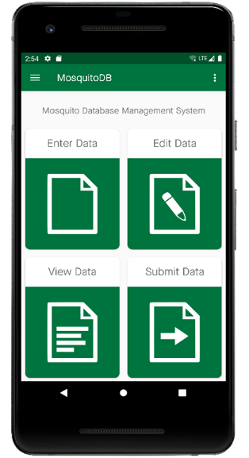
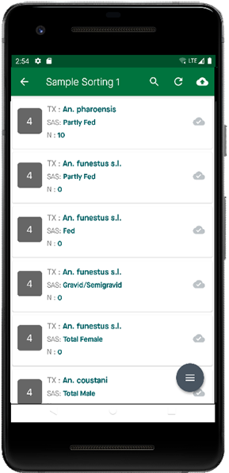

Soumettre des données
======================

**NB :** Cette fonctionnalité est utilisée pour envoyer des données vers le cloud, pour l'utiliser, vous devez déjà avoir saisi des données via les formulaires.

| **Étape 1:** Sur la page d'accueil, sélectionnez **Soumettre les données**, puis sélectionnez le formulaire dont vous souhaitez soumettre les données et, par exemple, le tri des échantillons
| **Étape 2:** Vous verrez tous les ensembles de données que vous avez entrés. 
| **Étape 3:** Cliquez sur l'icône du nuage pour pousser toutes vos données simultanément.  

