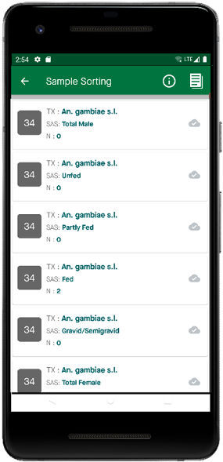
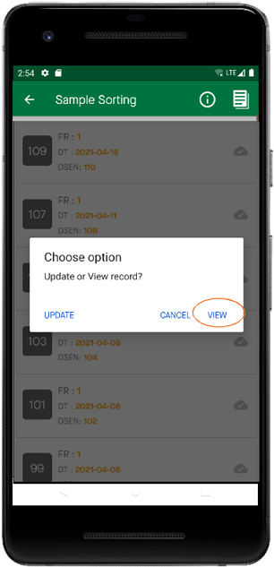

Afficher les données
=====================

| **Étape 1:** Sur la page d'accueil, sélectionnez **Afficher les données**, puis sélectionnez le formulaire dont vous souhaitez afficher les données et, par exemple, le tri des échantillons
| **Étape 2:** Sélectionnez l'ensemble de données que vous souhaitez afficher
| **Étape 3:** Cliquez sur Afficher 

