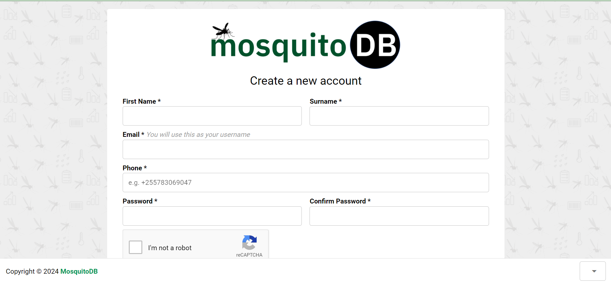

Overview
========

MosquitoDB’s web-based application is a secure and dynamic application that can store, link, facilitate data sharing, and generate summarized reports from field and laboratory mosquito-based data collected/recorded from either paper-or-electronic based data collection forms in standardized formats.

It ensures quality data collection, proper linkage between projects and users, secure storage, standardized datasets, easy sharing of data within and outside the team and interactive visualization of stored data.

