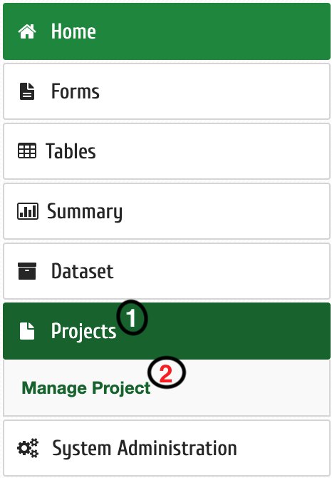
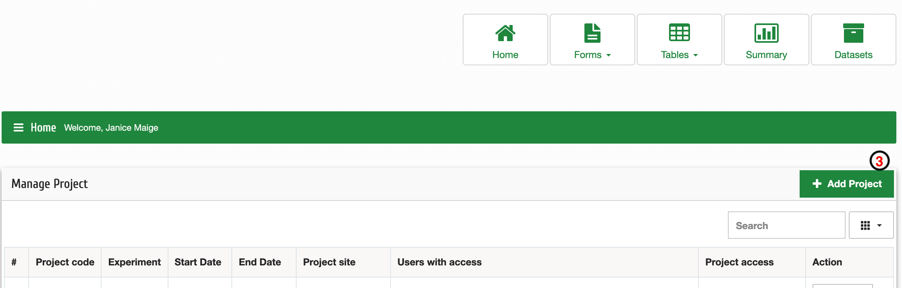
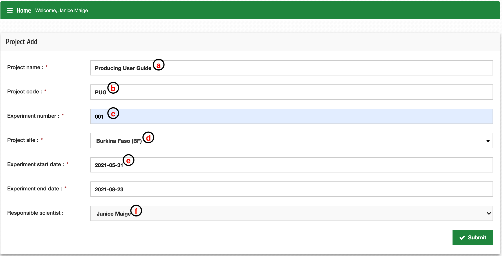

Add a project
=============

| **Step 1**: Click Projects
| **Step 2**: Click Manage Project
| **Step 3**: Click +Add Project

| **Step 4**: Enter project details; 
|            **a**: Project name – long format (e.g., Producing User Guide)
|            **b**: Project code – Abbreviation of the project name(e.g., TEG)
|            **c**: Experiment number (e.g., 1 if it's the first experiment for the project
|            **d**: Select site name from a drop downmenu (if not available – Add a site?)
|            **e**: Select appropriate date - same for expected end date
|            **f**: Select responsible scientist from dropdown menu (e.g., Project Leader)

| Then click "Submit"

