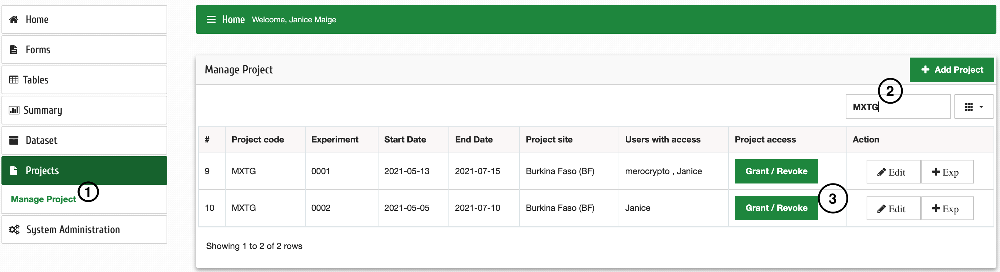
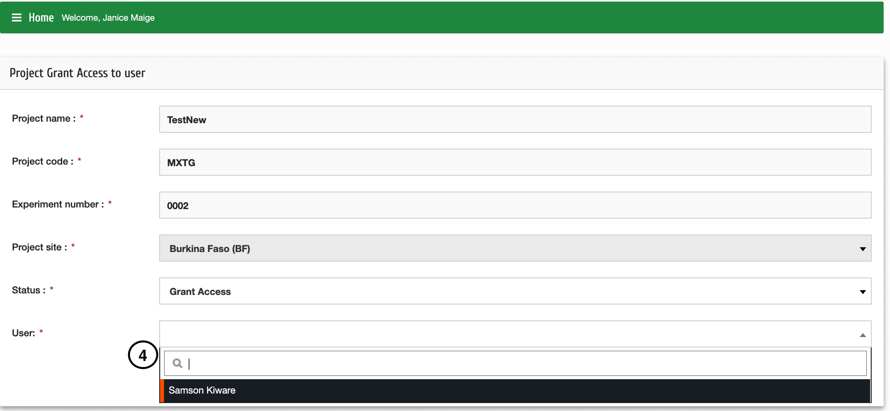

Grant access to an existing project
====================================

| **Step 1**: Click Projects then Manage Project
| **Step 2**: Search your project based on the project code (e.g., MXTG) 
| **Step 3**: Click on Grant/Revoke button

| **Step 4**: Select the user you want on the user dropdown 

| Then click "Submit"

