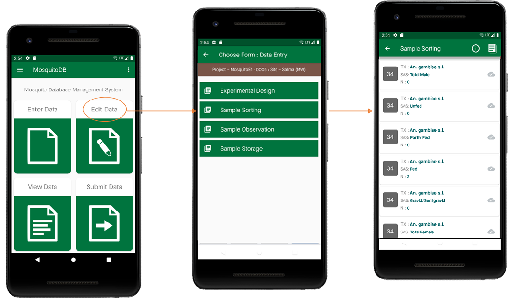

Edit Data
==========

| **Step 1:** On the Home Page, Select **Edit Data**
| **Step 2:** Select the form whose data you want to edit e.g Sample Sorting 
| **Step 3:** Select whether to view or Update the Data. On clicking update you'll be able to edit the data. 
| **Step 4:** Click Save to keep your updated changes. 

.. image:: ../../_images/update.png
   :width: 22%

